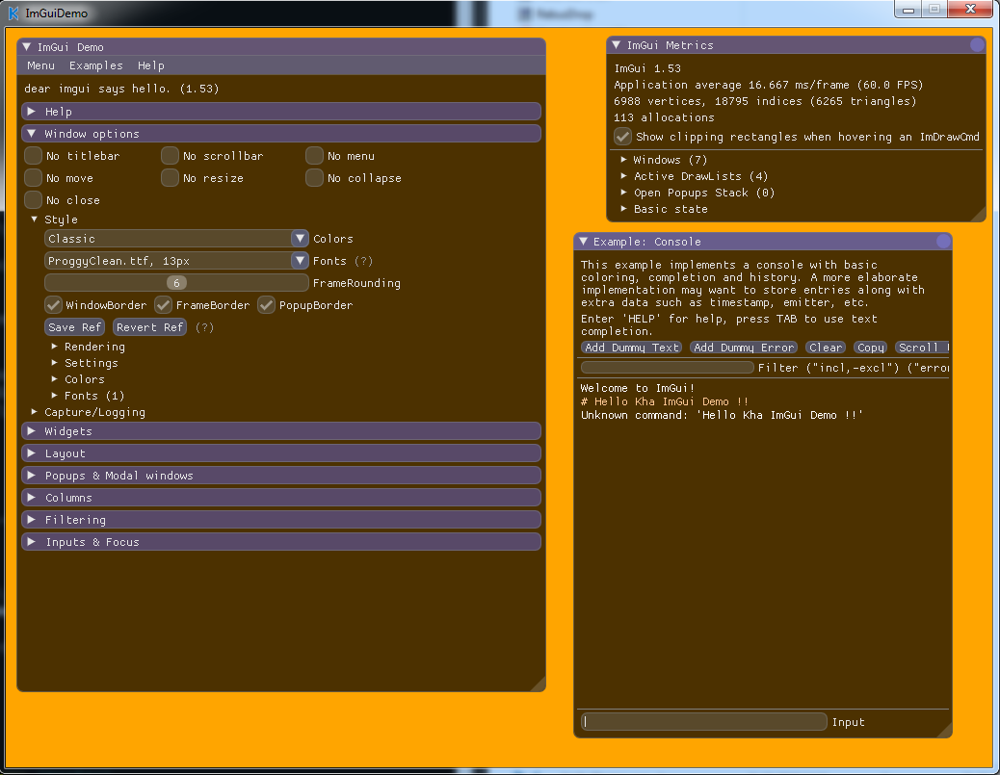

# Kha ImGui

Demo project, using [linc_imgui](https://github.com/Aidan63/linc_imgui) bindings for [ImGui](https://github.com/ocornut/imgui) library with [Kha](https://github.com/Kode/Kha) engine.



# Dependencies

You'll need [Node.js](https://nodejs.org/) 8.0+ to build project.

# HowTo

 - Clone:

```
git clone --recursive https://github.com/CoruNethron/KhaImGuiDemo
```

 - Build:

```
cd KhaImGuiDemo
node Kha/make --compile windows -v vs2017
```

Executable will be in build/windows/KhaImGuiDemo.exe

# Testing

Basic keyboard/mouse input was tested, as well as clipboard operations.

There may be bugs in demo project here and there. It's likely, that there is minor memory leak somewhere in Sources/ImGuiDemo.hx -> onRender()

Tested build under windows, using VS 2015 and 2017. But expected to build normally under Linux / MacOS as well.
